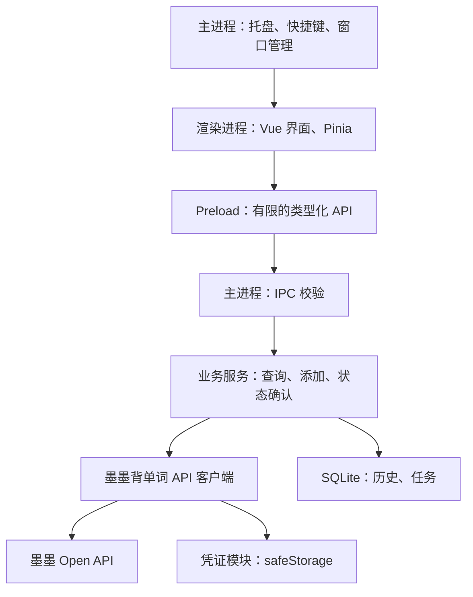

# 墨墨背单词跨平台桌面客户端技术方案

更新时间：2026-09-12

状态：M1 与 M2 已实施；M1 完成真实账号 apple 新增及手机端确认，M2 完成持久化、恢复和桌面行为的 Windows 自动验证。验收记录见 [M1](docs/M1_ACCEPTANCE.md) 与 [M2](docs/M2_ACCEPTANCE.md)。M3 尚未实施。

## 1. 目标与范围

采用 **Electron + TypeScript + Vue 3** 开发 Windows、macOS、Linux 桌面客户端，由 Electron 主进程直接调用墨墨背单词 Open API。

核心场景：用户在电脑上遇到生词，输入单词、查询对应词条、确认后加入墨墨背单词学习规划。

仅对接官方文档中的「墨墨背单词」分组，不涉及墨墨记忆卡的牌组、章节、卡片等功能。「加入学习规划」与「加入云词本」是两个独立操作，本项目优先实现前者。

第一版面向个人自用，使用个人 Token，无需自建服务器。官方 CLI 仅用于开发时验证接口和排查问题，不作为客户端运行依赖。

| 阶段   | 功能                                                               |
| ------ | ------------------------------------------------------------------ |
| 第一版 | Token 配置、单词查询、加入学习规划、最近添加记录、托盘、全局快捷键 |
| 第二版 | 剪贴板快捷查词、批量添加、离线待提交列表、云词本管理               |
| 后续   | 正式账号授权登录、独立词典释义、自动更新                           |

## 2. 已核对的 API 能力与限制

资料来源：[官方文档](https://open.maimemo.com/#/)、[OpenAPI 规范](https://open.maimemo.com/api_bundle.yaml)。以下是 2026-09-11 读取公开规范得到的结论，实施时需要结合真实响应验证。

- 单词接口的 `Vocabulary` 模型只保证包含 `id` 和 `spelling`，不能假定它返回完整释义、音标或发音。
- 获取释义接口当前描述为「获取单词下自己创建的释义」。2026-09-17 已接入 UAPI 独立词典：墨墨负责词条匹配及学习规划，UAPI 按拼写提供中文释义和英美音标，使用免密钥免费额度并缓存结果；释义失败不阻断添加。
- 添加单词接口返回 `added_count`。重复添加或单词上限不足都可能导致成功数量小于请求数量。
- 学习数据接口处于公测，官方不保证可用性，可能调整，需要在手机 App 开启自动同步。
- 今日学习数据还涉及 App 当日初始化，不能用今日列表是否包含某词作为是否加入整个学习规划的唯一依据。
- 官方当前请求限制包括每 10 秒 20 次、每分钟 40 次、每 5 小时 2000 次；同一用户在其他应用产生的请求也可能影响可用额度。

## 3. 产品交互

核心路径：

```text
快捷键唤出窗口
    → 输入单词
    → Enter 查询
    → 确认匹配的词条
    → Ctrl/Cmd + Enter 加入学习规划
    → 展示结果
    → Esc 隐藏窗口
```

第一版提供查词、历史、设置三个页面。

- 唤出窗口后自动聚焦输入框。
- 查询与添加使用不同快捷键，避免连续按 Enter 时误添加；中文输入法组合输入期间不触发提交。
- 查询时保留原始输入，只做必要的首尾空白处理，不静默替换词形或改变成另一个词。
- 添加期间禁用重复操作，成功后明确显示「已加入学习规划」。
- 最近添加记录指本客户端的操作历史，不代表手机端当前全部学习状态。
- 第二阶段的剪贴板读取由用户主动触发，不持续监听剪贴板。

## 4. 技术选型

| 层次       | 选择                    | 用途                                 |
| ---------- | ----------------------- | ------------------------------------ |
| 桌面运行时 | Electron                | 窗口、托盘、快捷键、系统集成         |
| 语言       | TypeScript，开启 strict | 主进程、preload、界面统一类型        |
| 界面       | Vue 3 + Composition API | 使用`<script setup lang="ts">`     |
| 构建       | electron-vite           | 分别构建 main、preload、renderer     |
| 界面状态   | Pinia                   | 查询状态、设置、历史列表             |
| HTTP       | Electron`net.fetch`   | 主进程访问 API，使用 Chromium 网络栈 |
| 运行时校验 | Zod                     | 校验 IPC 参数和接口关键字段          |
| 本地数据库 | SQLite + better-sqlite3 | 历史、任务状态、设置                 |
| 凭证保护   | Electron`safeStorage` | 加密保存 Token                       |
| 打包       | electron-builder        | 各平台安装包                         |
| 测试       | Vitest + Playwright     | 业务逻辑与桌面操作流程               |

依赖版本在搭建项目时选择互相兼容且仍受支持的版本，通过锁文件固定。Playwright 对 Electron 的支持为实验性能力，需要验证与所选 Electron 版本的兼容性。

第一版使用简单 Vue 组件和 CSS 构建小窗口，组件库按实际需求引入。暂不引入本地 HTTP 服务、ORM 或复杂的依赖注入框架。

## 5. 进程架构



### 5.1 渲染进程

负责页面展示、输入、交互反馈和临时界面状态。业务请求通过 preload 暴露的方法完成；不直接读取数据库、持久化 Token 或调用墨墨接口。

### 5.2 Preload

通过 `contextBridge` 暴露有限的业务方法，不暴露完整 `ipcRenderer`、通用请求方法、任意文件访问或 SQL 执行能力。

以下是客户端内部契约草案，不是墨墨原始 API 定义：

```ts
interface DesktopApi {
  credentials: {
    save(token: string): Promise<Result<void>>
    status(): Promise<Result<CredentialStatus>>
    clear(): Promise<Result<void>>
    copy(): Promise<Result<void>>
    reveal(): Promise<Result<string>>
    validate(): Promise<Result<void>>
  }
  vocabulary: {
    lookup(spelling: string): Promise<Result<Vocabulary[]>>
  }
  study: {
    add(vocId: string): Promise<Result<AddOutcome>>
    confirm(vocId: string): Promise<Result<AddOutcome>>
  }
  history: {
    list(input: HistoryQuery): Promise<Result<HistoryPage>>
  }
}
```

`Result` 使用可序列化的成功/失败联合类型。业务错误通过明确的错误代码和用户提示传递，不依赖跨 IPC 传递原始异常对象。事件订阅方法应返回取消订阅函数。

### 5.3 主进程

负责窗口管理、托盘、快捷键、IPC 校验、凭证、HTTP 请求、限流、数据库及业务状态。业务服务与原始 API 客户端分离，避免接口调整直接影响 Vue 组件。

窗口显式配置：

```ts
webPreferences: {
  preload: preloadPath,
  contextIsolation: true,
  nodeIntegration: false,
  sandbox: true
}
```

主进程校验 IPC 来源和参数；生产环境加载打包的本地资源并配置严格 CSP，限制页面导航及新窗口。外链经过协议和目标校验后交给系统浏览器。接口内容默认按纯文本渲染。

## 6. API 接入设计

### 6.1 基础地址与接口

```text
https://open.maimemo.com/open/api/v1/memo
```

请求通过 `Authorization: Bearer <token>` 鉴权。下表路径相对于上述基础地址。

| 能力         | 方法与路径                          | 用途                   |
| ------------ | ----------------------------------- | ---------------------- |
| 单词查询     | `GET /vocabulary?spelling=apple`  | 获取单词 ID 和拼写     |
| 列表查询     | `POST /vocabulary/query`          | M1 单个拼写多结果；第二阶段批量解析 |
| 添加单词     | `POST /study/add_words`           | 加入学习规划           |
| 查询学习记录 | `POST /study/query_study_records` | 辅助确认词条是否已加入 |

查询参数使用 `URLSearchParams` 构造。API 地址由主进程固定，不接受渲染进程提供的任意地址。

### 6.2 添加请求

```json
{
  "words": [
    { "id": "查询得到的单词ID" }
  ],
  "advance": false
}
```

`advance` 是必填项，第一版固定为 `false`。规范允许一次最多添加 1000 个词，但第一版每次添加一个词，便于准确呈现结果。

响应的关键业务字段为 `added_count`，需要同时检查 HTTP 状态、业务错误和响应结构，不能仅凭 HTTP 200 提示添加成功。

### 6.3 MaimemoClient

集中处理以下职责：

- 凭证注入、URL 构造、请求超时与取消。
- HTTP 错误、业务错误及响应关键字段校验。
- 多时间窗口限流、退避及有限次数的查询重试。
- 原始响应到内部领域类型的转换。
- 脱敏日志：记录操作类型、耗时、状态码和错误代码，不记录 Token 或完整鉴权头。

初步将单次请求超时设为 15 秒，后续根据联调调整。限制响应大小，不把服务端原始错误内容不加处理地暴露给界面。

## 7. 查询与添加流程

### 7.1 查询

按 Enter 查询，减少不必要请求。连续查询不同单词时取消旧请求，或使用请求序号忽略过期结果，防止慢响应覆盖当前词条。未收录词明确提示，不创建虚构词条 ID。

可以短期缓存单词 ID 与拼写映射；本地缓存不用于断言当前学习状态。

同一个查询条件可能会查询多个单词出来，用户可以选择将哪个单词加入 [添加单词](https://open.maimemo.com/#/operations/maimemo.openapi.memo.study.v1.StudyService.AddWords)

### 7.2 添加结果

| 情况                                   | 行为                                                         |
| -------------------------------------- | ------------------------------------------------------------ |
| `added_count = 1`                    | 显示「已加入学习规划」                                       |
| `added_count = 0`                    | 查询学习记录，查到则显示「已在学习规划中」                   |
| 返回 0 且暂未查到记录                  | 显示「未新增，可能已添加或单词上限不足」，提供进一步确认入口 |
| 写请求超时、连接中断或服务端结果不明确 | 标记「结果待确认」，查询服务端状态                           |
| 明确鉴权失败                           | 提示更新 Token，暂停该配置相关任务                           |
| 明确参数或权限错误                     | 展示可理解的错误原因，不自动重试                             |

学习记录可能存在同步延迟，暂未查到不能证明写入失败。确认请求应有限次数执行，仍无法确认则保持待确认状态。

客户端区分「本次新增成功」与「确认已在学习规划中」；后者不能用于断言由本次请求完成新增。

### 7.3 去重与恢复

主进程按「本地账号配置 ID + 单词 ID」合并正在执行的添加操作。此措施只防止客户端并发重复操作，不代表服务端承诺幂等。

操作状态建议包括：

```text
submitting  提交中
added       本次新增成功
present     已确认在学习规划中
not_added   本次未新增
uncertain   结果待确认
failed      明确失败
```

发送写请求前持久化操作。应用重启时，遗留的 `submitting` 转为 `uncertain`，先确认状态，不直接重发。第二阶段再增加 `queued`、`cancelled` 等离线队列状态。

查询类操作可退避重试；已发出的写请求在结果不确定时不自动重复提交。取消客户端请求也不能等同于撤销服务端写入。

批量添加阶段注意：接口只提供成功总数，不能据此把所有词都标记成功。部分成功时需要逐项或批量查询记录辅助确认。

## 8. 本地数据与凭证

### 8.1 SQLite

数据存放在 Electron 应用数据目录中，数据库只由主进程访问。

| 表                  | 主要字段                                                            |
| ------------------- | ------------------------------------------------------------------- |
| `profiles`        | 本地配置 ID、名称、凭证引用                                         |
| `word_operations` | 操作 ID、配置 ID、词条 ID、拼写、状态、创建时间、确认时间、错误代码 |
| `settings`        | 快捷键、窗口位置、主题、关闭行为                                    |

`word_operations` 同时支撑最近添加记录和任务恢复。按配置及时间建立历史查询索引，使用事务更新状态，添加数据库版本与迁移机制。

better-sqlite3 使用同步接口，第一版保持短事务和分页读取；后续若有大批量导入或慢查询，再将相应操作移到工作线程。避免在主进程长时间同步处理。

第一版支持一个活动配置即可。本地配置 ID 是应用自己的标识，不假定等于墨墨用户 ID。替换 Token 时处理配置归属；更换账号应暂停旧配置任务，不能自动提交到新账号。

### 8.2 Token

保存后自动通过只读词条查询验证 Token，也支持手动再次验证；不添加学习规划、不写入学习历史。成功仅表示本次查询鉴权通过，不承诺其他接口权限或长期有效。明确鉴权失败标记当前配置失效；网络、限流或服务异常提示暂时无法完成验证。验证通过状态仅在本次运行保留，更换配置后重置。查词页先读取凭证状态，仅在未配置时显示首次使用引导；已配置但失效时显示更新提示。

设置页面把 Token 提交给主进程，主进程用 `safeStorage` 加密并将密文写入应用数据目录。界面默认仅获取凭证状态并显示遮罩；用户点击小眼睛时通过受来源校验的 `credentials.reveal()` 按需获取已保存 Token 的明文，再次点击、离开设置页或窗口失焦时隐藏并清除该明文界面状态。输入新 Token 时也支持显隐切换。复制按钮由主进程写入系统剪贴板；查看和复制不会修改凭证，更换 Token 需单独进入编辑并保存。

## 9. 工程目录

```text
src/
  main/
    index.ts
    windows.ts
    tray.ts
    shortcuts.ts
    ipc/
    services/
      vocabulary-service.ts
      study-service.ts
    maimemo/
      client.ts
      schemas.ts
      errors.ts
    storage/
      database.ts
      credential-store.ts
      migrations/
  preload/
    index.ts
  renderer/
    src/
      views/
        SearchView.vue
        HistoryView.vue
        SettingsView.vue
      components/
      stores/
      composables/
  shared/
    contracts.ts
    models.ts
    result.ts
tests/
electron.vite.config.ts
electron-builder.yml
```

`shared` 只存放可跨进程使用的类型、契约和常量。Pinia 管理界面状态，持久化业务数据以主进程为准。

## 10. 桌面行为与跨平台交付

- 单实例运行，重复启动时唤出已有窗口。
- 全局快捷键可自定义，检测冲突并提示；退出时注销。
- 区分「隐藏窗口」与「退出应用」，托盘提供明确退出入口。
- 托盘或快捷键不可用时，保留常规窗口入口，避免窗口关闭后无法恢复。
- 多显示器变化时校正窗口位置，保证重新打开后可见。
- Linux Wayland 的快捷键依赖桌面 Portal，需要在目标桌面环境实际验证。
- 开机启动作为后续可选设置，不默认开启。

使用 electron-builder，在对应平台的 CI runner 构建和验证。

| 平台    | 首批目标安装包                |
| ------- | ----------------------------- |
| Windows | x64 NSIS 安装包               |
| macOS   | Apple Silicon、Intel 对应 DMG |
| Linux   | x64 AppImage、deb             |

SQLite 原生依赖必须匹配 Electron ABI、目标操作系统和架构，并验证打包后的加载路径。macOS 正式分发安排签名与公证，保持稳定的应用标识和签名；Windows 正式发布评估代码签名。

第一版手动下载更新；后续再接入自动更新并验证签名、版本迁移和更新失败恢复。

## 11. 实施里程碑

### M1：接口闭环

实施进度：工程、凭证、查询、添加和学习记录确认已实现；55 项单元测试、3 项 Electron 端到端测试与生产构建通过。用户已在应用内配置真实凭证并指定 apple，单次添加返回 added_count=1，随后按词条 ID 查到学习记录。M1 接口闭环已验收。

- 创建 Electron + Vue + TypeScript 工程，完成主进程和 preload 边界。
- 实现凭证保存、单词查询、添加单词和学习记录确认。
- 使用模拟响应验证状态处理。
- 在用户配置的账号上手动联调。

完成标准：单词能从电脑准确加入学习规划，失败和不确定结果不会被显示为成功。

### M2：日常可用

实施进度：查词/历史/设置、SQLite 迁移与提交日志、重启只读确认、配置隔离与鉴权暂停、托盘、可配置全局快捷键、单实例、Esc 隐藏、窗口位置与主题设置已完成。Windows 上 77 项单元测试、9 项 Electron 端到端场景及生产构建通过；macOS/Linux 实机验收随 M3 执行。

- 完成查词、历史、设置页面。
- 接入 SQLite 操作历史和重启恢复。
- 完成托盘、快捷键、单实例、窗口隐藏与恢复。
- 完成凭证失效、限流、网络异常处理。

完成标准：核心操作可通过键盘完成，应用退出重启后记录可靠，日常异常有清晰反馈。

### M3：跨平台交付

- 配置各平台构建和打包。
- 验证原生依赖、凭证存储、安装及更新后的数据兼容性。
- 在目标平台执行安装包核心流程测试。
- 编写安装、Token 配置、手机自动同步及常见问题说明。

完成标准：目标平台安装包能安装、启动、保存凭证、查词和添加，异常退出后能恢复状态。

## 12. 测试与验收

| 类别       | 重点场景                                                         |
| ---------- | ---------------------------------------------------------------- |
| 查询       | 正常词、未收录词、带空格输入、连续查询、过期响应、输入法组合输入 |
| 添加       | 正常新增、重复添加、单词上限不足、连续点击、非法词条 ID          |
| 可靠性     | 写入后超时、同步延迟、退出时仍有请求、重启恢复、账号切换         |
| 鉴权与限流 | Token 失效、权限不足、429、多时间窗口限流、查询退避              |
| 本地存储   | 凭证加密不可用、数据库迁移、历史分页、明文凭证不落盘             |
| IPC        | 非法参数、非预期来源、无法调用任意网络或文件能力                 |
| 桌面行为   | 托盘、快捷键冲突、多显示器、窗口关闭与退出、单实例               |
| 分发       | 各平台安装、原生模块加载、升级后凭证和历史仍可用                 |

Vitest 覆盖 API 适配、状态转换、去重、限流和数据库恢复。Playwright 覆盖关键界面与 IPC 流程，并保留目标平台人工验收。

自动测试默认使用模拟 API，不在普通测试或 CI 中访问真实账号。真实账号联调单独执行，记录所添加的测试词，避免反复改变学习规划。

## 13. 实施前需验证的事项

- 真实响应是否有额外包装，错误码及未收录词的具体返回。
- 学习记录查询在新增后的同步延迟和匹配语义。
- Token 权限是否覆盖查询、添加和学习记录查询。
- 所选 Electron、构建工具、SQLite 原生模块及 Playwright 版本兼容性。
- Linux 目标桌面的密钥存储、托盘和快捷键支持。

这些验证是 M1 和 M3 的实施任务，不影响先完成本地工程和模拟接口开发。

## 14. 参考资料

- [墨墨开放 API 文档](https://open.maimemo.com/#/)
- [墨墨 OpenAPI 规范](https://open.maimemo.com/api_bundle.yaml)
- [墨墨开放平台说明](https://memodocs.maimemo.com/docs/open/)
- [官方 CLI](https://github.com/maimemo/memo-api-cli)
- [Vue 与 TypeScript](https://vuejs.org/guide/typescript/overview.html)
- [electron-vite](https://electron-vite.org/guide/)
- [Electron 安全建议](https://www.electronjs.org/docs/latest/tutorial/security)
- [Electron net](https://www.electronjs.org/docs/latest/api/net)
- [Electron safeStorage](https://www.electronjs.org/docs/latest/api/safe-storage)
- [Electron globalShortcut](https://www.electronjs.org/docs/latest/api/global-shortcut)
- [better-sqlite3](https://github.com/WiseLibs/better-sqlite3)
- [electron-builder](https://www.electron.build/)
- [Playwright Electron 支持](https://playwright.dev/docs/api/class-electron)
